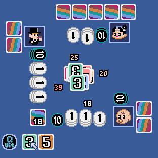
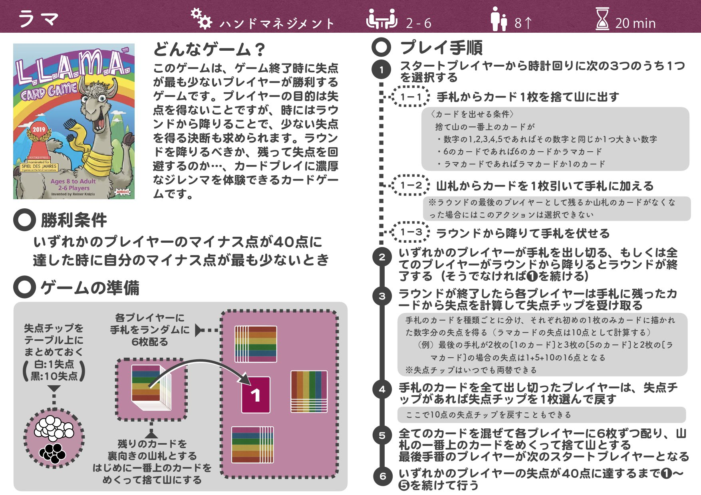

# ラマ

## 操作方法

* マウスを使って操作します。
* 「LAMA Mode」（ラマモード）又は「KUMA Mode」（クマモード）をクリックするとゲームスタートです。
* カードをクリックし、同じカードをもう1回クリックすると、カードを出せます。
* 山札からカードを引いたり、ラウンドを降りる場合も、2回クリックします。
* 3秒程度長押しすると、相手のカードがオープンになります。

  ## 遊び方

* 独自の「KUMA Mode」（クマモード）は、通常の「LAMA Mode」（ラマモード）に比べ
  * 7種のカードを1枚ずつ集めても、アガリとなります。
  * カード枚数が、35枚（7種各5枚）と少なくなっています。
  * 失点が、50点に達するとゲーム終了です。
